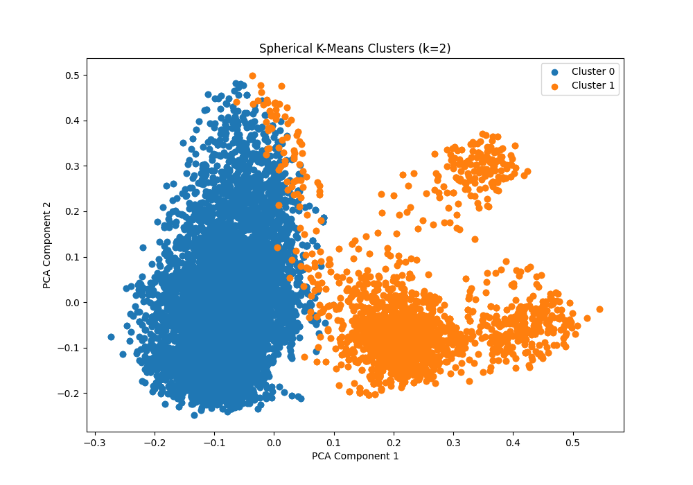
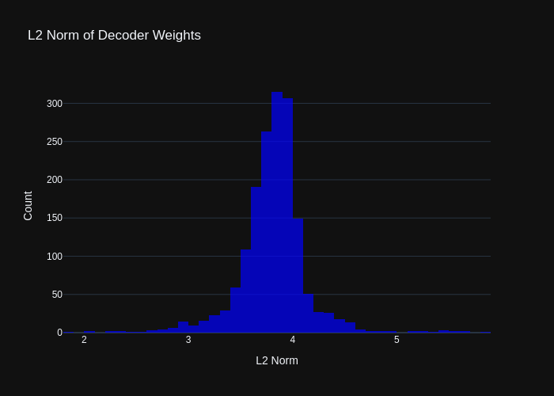

# Log


# What's New

sudo apt-get install python3.11-dev 

tmux
cd MindEyeV2/src/
source fmri/bin/activate

# Pre-requisites 
Run these first

export GLOBAL_BATCH_SIZE=8
export DS_SKIP_CUDA_CHECK=1

### Visualizing SAE
sbatch --job-name=mindeye_train --output=output_%j.log --error=error_%j.log --ntasks=1 --gpus=2 --cpus-per-task=16 --mem=128G --time=8:00:00 --partition=general --wrap="CUDA_VISIBLE_DEVICES=0,1,2,3 accelerate launch --mixed_precision=bf16 --num_processes 2 viz1.py"

### Training SAE
*4 GPUs*
sbatch --job-name=mindeye_train --output=output_%j.log --error=error_%j.log --ntasks=1 --gpus=4 --cpus-per-task=16 --mem=128G --time=8:00:00 --partition=general --wrap="CUDA_VISIBLE_DEVICES=0,1,2,3 accelerate launch --mixed_precision=bf16 --num_processes 2 Train.py --model_name=final_subj01_pretrained_1sess_24bs --no-multi_subject --subj=1 --batch_size=2 --max_lr=3e-4 --mixup_pct=.33 --num_epochs=150 --use_prior --prior_scale=30 --clip_scale=1 --no-blurry_recon --blur_scale=.5 --no-use_image_aug --n_blocks=4 --hidden_dim=1024 --num_sessions=1 --wandb_log"

*2 GPUs*
sbatch --job-name=mindeye_train --output=output_%j.log --error=error_%j.log --ntasks=1 --gpus=2 --cpus-per-task=16 --mem=128G --time=8:00:00 --partition=general --wrap="CUDA_VISIBLE_DEVICES=0,1 accelerate launch --mixed_precision=bf16 --num_processes 2 Train.py --model_name=final_subj01_pretrained_1sess_24bs --no-multi_subject --subj=1 --batch_size=1 --max_lr=3e-4 --mixup_pct=.33 --num_epochs=150 --use_prior --prior_scale=30 --clip_scale=1 --no-blurry_recon --blur_scale=.5 --no-use_image_aug --n_blocks=4 --hidden_dim=1024 --num_sessions=1 --wandb_log"

### Pictures







# MindEye2

**Paper (ICML 2024): https://arxiv.org/abs/2403.11207**

<br>

## Installation

1. Agree to the Natural Scenes Dataset's [Terms and Conditions](https://cvnlab.slite.page/p/IB6BSeW_7o/Terms-and-Conditions) and fill out the [NSD Data Access form](https://forms.gle/xue2bCdM9LaFNMeb7)

2. Git clone this repository:

```
git clone https://github.com/MedARC-AI/MindEyeV2.git
cd MindEyeV2/src
```

3. Download https://huggingface.co/datasets/pscotti/mindeyev2 contents into the src folder from your git clone.

Warning: Cloning the entire huggingface dataset will be over 100 GB of data!

The below code will download the subset of files required to run all our training / inference / evaluation code (does not download pretrained models).

```
import os
from huggingface_hub import list_repo_files, hf_hub_download

repo_id, branch, exclude_dirs, exclude_files = "pscotti/mindeyev2", "main", ["train_logs", "evals"], ["human_trials_mindeye2.ipynb", "subj01_annots.npy", "shared1000.npy"]

include_specific_files = ["evals/all_images.pt", "evals/all_captions.pt", "evals/all_git_generated_captions.pt"]

def download_files(repo_id, branch, exclude_dirs, exclude_files, include_specific_files):
    files = list_repo_files(repo_id, repo_type="dataset", revision=branch)
    for file_path in files:
        if (not any(ex_dir in file_path for ex_dir in exclude_dirs) or file_path in include_specific_files) and not any(ex_file in file_path for ex_file in exclude_files):
            hf_hub_download(repo_id, filename=file_path, repo_type="dataset", revision=branch, local_dir=os.getcwd())

download_files(repo_id, branch, exclude_dirs, exclude_files, include_specific_files)
```

4. Run ```. setup.sh``` to install a new "fmri" virtual environment. Make sure the virtual environment is activated with "source fmri/bin/activate".

## Usage

MindEye2 consists of four main jupyter notebooks: `Train.ipynb`, `recon_inference.ipynb`, `enhanced_recon_inference.ipynb`, and `final_evaluations.ipynb`. 

These files can be run as Jupyter notebooks or can be converted to .py files with configuration specified via argparser. 

If you are training MindEye2 on a single GPU on the full 40 sessions, expect that pre-training and fine-tuning both take approximately 1 day to complete.

- ```src/Train.ipynb``` trains/fine-tunes models (single-subject or multi-subject depending on your config). Check the argparser arguments to specify how you want to train the model (e.g., ```--num_sessions=1``` to train with 1-hour of data).
    - Final models used in the paper were trained on an 8xA100 80GB node and will OOM on weaker compute. You can train the model on weaker compute with very minimal performance impact by changing certain model arguments: We recommend lowering hidden_dim to 1024 (or even 512), removing the low-level submodule (``--no-blurry_recon``), and lowering the batch size.
    - To train a single-subject model, set ```--no-multi_subject``` and ```--subj=#``` where # is the subject from NSD you wish to train
    - To train a multi-subject model (i.e., pretraining), set ```--multi_subject``` and ```--subj=#``` where # is the one subject out of 8 NSD subjects to **not** include in the pretraining.
    - To fine-tune from a multi-subject model, set ```--no-multi_subject``` and ```--multisubject_ckpt=path_to_your_pretrained_ckpt_folder```
    - Note if you are running multi-gpu, you need to first set your accelerate to use deepspeed stage 2 (with cpu offloading) via "accelerate config" in terminal ([example](https://i.imgur.com/iIbvcPq.png))
- ```src/recon_inference.ipynb``` will run inference on a pretrained model, outputting tensors of reconstructions/predicted captions/etc.
- ```src/enhanced_recon_inference.ipynb``` will run the refinement stage for producing better looking reconstructions. These refined reconstructions are saved as *enhancedrecons.pt in the same folder used by recon_inference.ipynb. The unrefined reconstructions were saved as *recons.pt as part of the recon_inference.ipynb notebook.
- ```src/final_evaluations.ipynb``` will visualize the saved reconstructions and compute quantitative metrics.
- See .slurm files for example scripts for running the .ipynb notebooks as batch jobs submitted to Slurm job scheduling.

## FAQ

### What are the main differences between this and MindEye1?

MindEye2 achieves SOTA reconstruction and retrieval performance compared to past work (including MindEye1). MindEye2 also excels in low-sample settings, with good performance even with just 1 hour of training data by first pretraining the model on other participants data. MindEye2 also releases a SOTA unCLIP model (unclip6_epoch0_step110000.ckpt) by fine-tuning SDXL; this raises the ceiling performance possible for reconstructing images from CLIP image latents. MindEye2 training is also more flexible thanks to our updated webdataset approach that allows one to easily obtain the brain activations corresponding to the current sample's previous/future timepoints, brain activations from other timepoints looking at the same image, and behavioral information (button press, reaction time, etc.). 

### Where are the pretrained models? What are their configs?

The pretrained models can be downloaded from huggingface (https://huggingface.co/datasets/pscotti/mindeyev2/tree/main/train_logs) and contain various model checkpoints following pre-training and following fine-tuning.

`final_multisubject_subj0#` refer to ckpts after pre-training MindEye2 on all subjects except for the subject listed in the filename. E.g., `final_multisubject_subj01` is the model pre-trained on subjects 2, 3, 4, 5, 6, 7, and 8 from NSD. Below are some additional details for the configs used in argparser when training the model:

```
accelerate launch --mixed_precision=fp16 Train.py --model_name=final_multisubject_subj0# --multi_subject --subj=# --batch_size=42 --max_lr=3e-4 --mixup_pct=.33 --num_epochs=150 --use_prior --prior_scale=30 --clip_scale=1 --blurry_recon --blur_scale=.5 --no-use_image_aug --n_blocks=4 --hidden_dim=4096 --num_sessions=40
```

`final_subj0#_pretrained_40sess_24bs` refer to ckpts after fine-tuning MindEye2 on the training data for the subject listed in the filename, initializing the starting point of the model from the ckpt saved from `final_multisubject_subj0#`.

```
accelerate launch --mixed_precision=fp16 Train.py --model_name=final_subj0#_pretrained_40sess_24bs --no-multi_subject --subj=# --batch_size=24 --max_lr=3e-4 --mixup_pct=.33 --num_epochs=150 --use_prior --prior_scale=30 --clip_scale=1 --blurry_recon --blur_scale=.5 --no-use_image_aug --n_blocks=4 --hidden_dim=4096 --num_sessions=40 --multisubject_ckpt=../train_logs/final_multisubject_subj0#
```

`final_subj0#_pretrained_1sess_24bs` refer to the same procedure as above but fine-tuned on only the first session of the subject's data. 

```
accelerate launch --mixed_precision=fp16 Train.py --model_name=final_subj0#_pretrained_1sess_24bs --no-multi_subject --subj=# --batch_size=24 --max_lr=3e-4 --mixup_pct=.33 --num_epochs=150 --use_prior --prior_scale=30 --clip_scale=1 --blurry_recon --blur_scale=.5 --no-use_image_aug --n_blocks=4 --hidden_dim=4096 --num_sessions=1 --multisubject_ckpt=../train_logs/final_multisubject_subj0#
```

`multisubject_subj01_1024hid_nolow_300ep` is the same as `final_multisubject_subj01` but pretrained using a less intensive pipeline where the low-level module was disabled and the hidden dimensionality was lowered from 4096 to 1024. These changes very minimally affected reconstruction and retrieval performance metrics and have the benefit of being much less computationally intensive to train. We set num_epochs=300 for this model but I do not think it would have made any difference if we had set it to num_epochs=150 instead, like the above models.

```
accelerate launch --mixed_precision=fp16 Train.py --model_name=multisubject_subj01_1024hid_nolow_300ep --multi_subject --subj=1 --batch_size=42 --max_lr=3e-4 --mixup_pct=.33 --num_epochs=300 --use_prior --prior_scale=30 --clip_scale=1 --no-blurry_recon --blur_scale=.5 --no-use_image_aug --n_blocks=4 --hidden_dim=1024 --num_sessions=40
```

### What are the "behav", "past_behav", "future_behav", "old_behav" arrays?

Our webdatasets only contain behavioral information; the brain activations and the seen images get loaded separately from hdf5 files and then indexed from these behav arrays accordingly. The webdataset tar files contain behav/past_behav/future_behav/old_behav matrices, although we only used "behav" for training MindEye2 (the other matrices can still be useful however, so we include them for you.)

Below is the lookup table for these arrays, with variables referenced from the Natural Scenes Dataset manual: https://cvnlab.slite.page/p/fRv4lz5V2F/Untitled

```
0 = COCO IDX (73K) (used to index coco_images_224_float16.hdf5)
1 = SUBJECT
2 = SESSION
3 = RUN
4 = TRIAL
5 = GLOBAL TRIAL (used to index betas_all_subj_fp32_renorm.hdf5)
6 = TIME
7 = ISOLD
8 = ISCORRECT
9 = RT
10 = CHANGEMIND
11 = ISOLDCURRENT
12 = ISCORRECTCURRENT
13 = TOTAL1
14 = TOTAL2
15 = BUTTON
16 = IS_SHARED1000
```

E.g., behav[0,:,9] corresponds to the 1st sample in the current batch's corresponding response time for the participant to press a button for that image.

-1 values in these arrays should be interpreted as NaNs.

past_behav gives you the behavioral information for samples corresponding the immediate previous timepoints samples.

future_behav gives you the behavioral information for samples corresponding to the immediate future timepoint samples.

old_behav gives you the behavioral information for the other repetitions of the given sample (remember to ignore -1s).

The code to create the above webdatasets and the hdf5 full of voxel brain activations can be found in src/dataset_creation.ipynb.


## Citation

If you make use of this work please cite the MindEye2 and MindEye1 papers and the Natural Scenes Dataset paper.

<br>

*MindEye2: Shared-Subject Models Enable fMRI-To-Image With 1 Hour of Data*

Scotti, Tripathy, Torrico, Kneeland, Chen, Narang, Santhirasegaran, Xu, Naselaris, Norman, & Abraham. MindEye2: Shared-Subject Models Enable fMRI-To-Image With 1 Hour of Data. International Conference on Machine Learning. (2024). arXiv:2403.11207  

<br>

*MindEye1: Reconstructing the Mind's Eye: fMRI-to-Image with Contrastive Learning and Diffusion Priors*

Scotti, Banerjee, Goode, Shabalin, Nguyen, Cohen, Dempster, Verlinde, Yundler, Weisberg, Norman, & Abraham. Reconstructing the Mind's Eye: fMRI-to-Image with Contrastive Learning and Diffusion Priors. Advances in Neural Information Processing Systems, 36. (2023). arXiv:2305.18274. 

<br>

*Natural Scenes Dataset: A massive 7T fMRI dataset to bridge cognitive neuroscience and artificial intelligence*

Allen, St-Yves, Wu, Breedlove, Prince, Dowdle, Nau, Caron, Pestilli, Charest, Hutchinson, Naselaris, & Kay. A massive 7T fMRI dataset to bridge cognitive neuroscience and artificial intelligence. Nature Neuroscience (2021).
